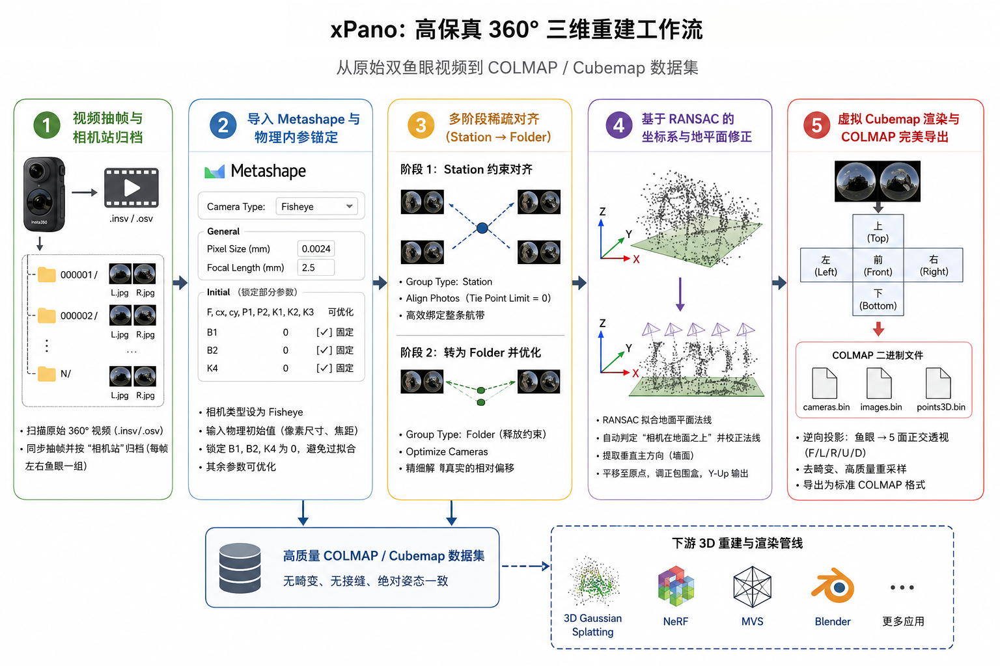
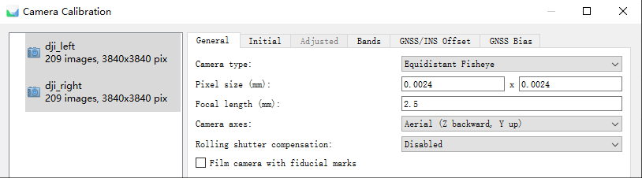
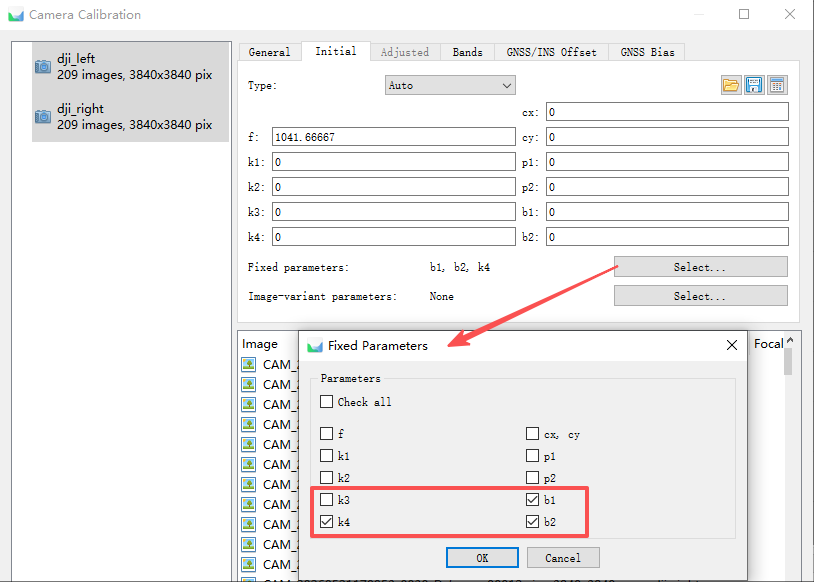
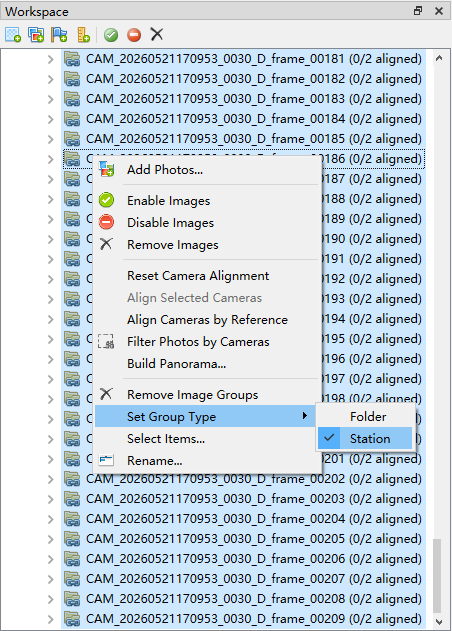
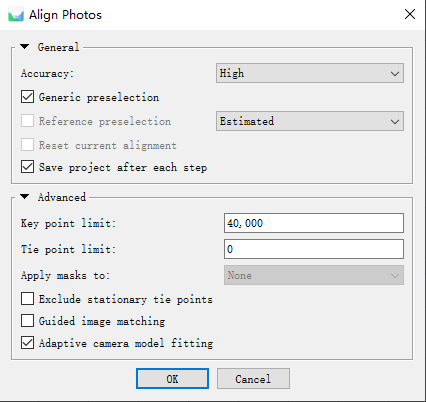

# xPano: High-Fidelity 3D Reconstruction Workflow for 360° Cameras

[](#)
[](#)

xPano 是一套专为双镜头 360° 全景相机（如 Insta360、DJI Osmo 360 等）设计的端到端三维重建物理对齐与数据转换系统。

传统全景重建往往依赖于官方软件将双鱼眼拼接为等距圆柱投影（Equirectangular Projection, ERP）全景图，再以一定的偏转角切割成数张透视切片，这在计算机视觉与摄影测量学中会引入不可逆的非线性畸变与撕裂。xPano 颠覆了这一传统，它提倡直接利用原始的双鱼眼文件进行空三解算，通过科学的相机站约束和物理参数标定锁定几何真实性，并在解算完成后利用逆向投影重映射算法，将鱼眼无缝切片为高质量的虚拟立方体贴图（Virtual Cubemap），从而完美适配 3D Gaussian Splatting (3DGS) 以及 NeRF 等下游三维重建管线。

💡 **提示**：本文档适用于已安装 Metashape 且习惯使用原生脚本工作流的用户（需根据指引手动配置环境与依赖）。如果希望避开繁琐的软件环境配置、体验免安装且一键式开箱即用的极简操作，请参阅 [GUI 版本操作文档](README.md) 。



---

## 核心物理哲学：为何必须拒绝拼接全景图（ERP）

拼接全景图在视觉传达上表现优秀，但在严格的摄影测量学和光束法平差（Bundle Adjustment）中却是一个灾难性的数据源。全景相机在物理结构上是由两枚背靠背、相距数厘米的鱼眼镜头组成的。为了消除视觉上的重影，拼接算法会应用动态光流形变和非刚性局部拉伸来强行“对齐”画面。这种拉伸在数学上是物理无序的，彻底摧毁了光学镜头固有的共线方程约束。重建算法无法建立稳定的相机内参模型去拟合这种被动态篡改过的画面，最终会导致解算出的稀疏点云在拼接缝区域出现特征漂移、重叠，甚至引起整条运动轨迹的非线性弯曲。

不仅如此，许多工作流试图在对齐阶段之前，先将拼接好的等距圆柱投影（ERP）全景图切割成数张透视切片再进行对齐。这一做法在计算效率上面临着极大的劣势。由于每个全景站点在对齐前就被强行切成了4至8张透视图像，需要对齐的图片基数瞬间暴增数倍。在摄影测量中，稀疏对齐阶段的特征匹配与平差计算复杂度与图像数量呈几何级数上升。直接对齐海量切片会导致对齐耗时极度漫长，甚至让计算机因内存耗尽而崩溃。

这种先切片后对齐的方式，在面对天空等弱特征区域时还会遭遇几何上的无解死局。在进行切片时，用户通常只能沿水平环绕切割一圈，即使带有一定的俯仰偏转，也难以有效处理正上方（天顶）的空域。天空区域几乎不存在任何可提取的稳定特征点。如果将指向天空的切片作为独立的相机参与对齐，平差解算器会因为缺乏有效的连接点（Tie Points）而无法将其定位，导致这些天空切片要么直接对齐失败，要么在三维空间中无序漂移，破坏整个相机轨迹的闭合性。

xPano 则通过逆转这一管线彻底解决了上述痛点，在对齐阶段坚持使用原始的 `.insv` 或 `.osv` 双鱼眼图像，每个抽帧瞬间仅有左右 2 张鱼眼图像参与计算，使得待对齐的图像总数降到了最低，空三计算耗时缩短了数倍甚至数十倍。更重要的是，在“相机站”的强物理约束下，无特征的天空区域（位于鱼眼边缘）与特征丰富的地面及墙面区域（位于同一张鱼眼画面中）被牢固地锁定在同一个传感器的刚性坐标系内。这意味着天空区域的相机姿态不需要依赖天空特征点，而是通过相机本身的物理刚性结构被间接、完美地外推解算出来。

只有当整条相机的稀疏轨迹被高精度对齐、优化并锁定之后，我们才在最终的 COLMAP 导出阶段进行虚拟 Cubemap 切片。这一设计将繁重的切片与去畸变计算完全后置，仅作为一次性的线性像素重采样输出，不再参与复杂的非线性平差迭代。这不仅保障了解算速度的跨越式提升，更确保了最终导出的全空域图像拥有零漂移、高精度的绝对姿态，从根本上杜绝了因非刚性拼接形变、两极拉伸以及弱特征区域引起的系统性几何误差累积。

---

## 快速开始与操作指南

### 第一步：视频抽帧与相机站归档

使用项目提供的 `pano_extractor.py` 脚本，自动扫描当前目录下的 `.insv` 或 `.osv` 全景原始视频流进行同步抽帧。

```bash
python scripts/pano_extractor.py
```

脚本在提取图像的同时，会自动为每一帧创建一个专属的子文件夹，将对应的左右两张鱼眼照片归档于此。这种收纳方式在摄影测量中被称为“相机站（Camera Station）”。双镜头全景相机的相对位姿在物理上是基本固定的，将同一时刻的左右鱼眼收纳在同一个相机站下，能帮助在后续步骤中利用极强的物理先验来引导稀疏对齐。

---

### 第二步：导入 Metashape 与物理内参锚定

将抽帧生成的相机站目录树完整导入 Agisoft Metashape 中。在开始运行对齐前，必须手动干预相机的内参初始化设置。这一步是决定整体稀疏对齐成功率以及重建几何精度的最关键基石。

打开 `Tools -> Camera Calibration` 窗口，在 General 选项卡中，将相机类型（Camera Type）由默认的 Frame 修改为 **Fisheye**。

在 General 面板中手动输入初始物理参数：将 **Pixel Size (mm)** 设置为 **0.0024**，将 **Focal Length (mm)** 设置为 **2.5**。



这个输入步骤的核心物理意义在于为非线性平差锁定一个符合光学常识的焦距初始值（Initial Value）。每个出厂的消费级全景相机都不可避免地存在制造公差，因此不需要将这两个数值填得绝对精准。其核心目的仅仅是为了让软件通过公式计算出的像素焦距 $f$ 在数量级上保持正确，避免算法在 EXIF 缺失的情况下误按 35mm 等效焦距去盲目猜测初始值，从而在源头上预防解算陷入非线性优化极值深渊，导致点云弯曲或分层。

切换到 **Initial** 面板，执行严苛的畸变参数锁定：
- 将 **B1, B2, K4** 这三项参数的数值全部强制修改为 **0**，并且**勾选对应的固定选项（Fix）将其彻底锁死**。
- 保持焦距（F）、像素尺寸、主点（cx, cy）以及 **P1, P2, K1, K2, K3** 为可优化状态。



现代全景镜头的工艺水平非常成熟，旨在描述薄棱镜非共轴畸变的参数 B1 和 B2 物理数值极小，在常规重建中几乎可以忽略不计。如果允许软件自由优化 B1 与 B2，算法极易在面对环境纹理噪点时进行“参数吸收”，产生过度拟合，反而导致内参物理意义崩溃。同样地，对于消费级鱼眼镜头，低阶的三阶径向畸变系数 K1、K2、K3 已经拥有足够的自由度来完美拟合光路弯曲。高阶项 K4 极易与 K3 产生极高的协方差关联，锁定 K4 能迫使算法将所有畸变误差高效率地集中在 K1、K2、K3 中进行快速收敛，不仅能极大提升空三稳定性，更让平差计算效率显著飙升。

---

### 第三步：多阶段稀疏对齐技巧（从 Station 到 Folder）

全景相机双镜头的相对位置解算极度敏感。如果直接设定为 Camera Rig 刚性装配进行对齐，一旦初始相对位姿标定有偏差，就会直接导致大量照片对齐失败。为了避开这一瓶颈，本项目采用“先约束、后释放”的双阶段对齐策略。

第一阶段：在对齐前，选中导入的所有相机，右键将它们的 `Group Type` 修改为 **Station**。这相当于给平差系统下达了一个强烈的几何命令：强制约束左右两张鱼眼相机的物理中心处于空间中的同一坐标点，仅允许它们存在方向上的旋转差异。



在此约束下，运行照片对齐（Align Photos），同时将 **Tie Point Limit** 设为 **0**（解除特征点上限限制），此时系统能够以极高效率实现大范围特征交会，将整条航带的相机姿态牢固地绑定在一起。



第二阶段：在初始稀疏对齐成功后，在 Workspace 中重新选中所有相机组，将其 `Group Type` 修改回 **Folder**（释放完全共点的硬性物理约束）。接着，点击工具栏的优化相机（Tools -> Optimize Cameras）按钮，让系统重新计算。此时，平差系统将在已有高精度姿态的基础上，精细、稳妥地解算出左右镜头之间真实存在的微小物理偏移与极限偏差。通过这种降维再释放的策略，既规避了初始相对参数未知的对齐困难，又较好地复原了真实的物理空间拓扑。

---

### 第四步：基于 RANSAC 的自动坐标系与地平面修正

在无 GPS 引导的稀疏对齐中，重构出的点云往往呈现无规律的倾斜甚至是上下颠倒状态。为了将其调正以符合常规建模与 3D 渲染器的视觉习惯，需要在 Metashape 中运行坐标系修正脚本 `align_ground_plane.py`。

```bash
# 在 Metashape 脚本控制台或菜单中载入执行
scripts/align_ground_plane.py
```

该脚本首先会自适应扫描全局的稀疏特征点云，通过 RANSAC（随机抽样一致）算法，在海量点云中搜寻并计算出最契合的物理地面平面法线。如果用户在界面中手动选择了一部分点作为参考，脚本会优先使用这些选中点进行拟合，实现极佳的人工辅助对齐。

拟合出地面后，脚本会读取所有相机的空间中心坐标并求平均，以判断“相机群在地面之上”这一绝对物理事实，从而自动翻转法线，确保地面的“向上”方向绝不颠倒。接着，脚本会在与地面正交的平面上寻找可能存在的垂直墙面，提取正面朝向。最后，脚本会自动构建一个全新的转换矩阵，不仅能将点云的核心区域精准平移至世界坐标原点，还会调正包围盒，并支持一键将坐标轴转换为适配 WebGL 和 3DGS 渲染器的 Y-Up 坐标系。

---

### 第五步：虚拟 Cubemap 渲染与 COLMAP 完美导出

这是 xPano 工作流最核心的数据转换引擎。通过运行 `metashape_export_colmap.py` 脚本，将对齐标定好的高质量鱼眼数据集导出为无畸变、无接缝的透视相机 COLMAP 格式。

```bash
# 在 Metashape 中通过 Run Script 执行该文件
scripts/metashape_export_colmap.py
```
#### 运行前准备（内置 Python 依赖安装）

由于 Metashape 运行在软件内置的独立 Python 嵌入式环境中，而非系统的全局 Python 环境。直接在普通的系统终端运行 `pip install opencv-python` 会导致脚本运行时抛出 `ModuleNotFoundError: No module named 'cv2'` 错误。

在运行脚本前，请使用管理员权限打开命令提示符（cmd）或终端，运行以下对应命令将依赖库安装至 Metashape 专属环境中：

* **Windows (如非默认安装路径，请自行分局实际情况修改):**
  ```bash
  "C:\Program Files\Agisoft\Metashape Pro\python\python.exe" -m pip install opencv-python
  ```
* **macOS:**
  ```bash
  /Applications/MetashapePro.app/Contents/MacOS/python/bin/python3 -m pip install opencv-python
  ```
* **Linux:**
  ```bash
  ./metashape-pro/python/bin/python -m pip install opencv-python
  ```
```

对于传统的透视相机（Frame），脚本会自动应用计算好的标定内参对其进行高质量的径向与切向畸变剔除，输出纯净的无畸变图像。

而对于全景双鱼眼镜头，脚本会以每个物理相机站的中心为原点，在空间中逆向渲染 5 张互成 $90^\circ$ 角的正交透视相机图片：**前（Front）、左（Left）、右（Right）、上（Top）、下（Bottom）**。

脚本首先构建出虚拟针孔相机在目标分辨率下的 3D 射线场，对于虚拟面上的每一个物理像素 $(u, v)$，将其投射为指向空间的 3D 视线向量 $\vec{v}(X, Y, Z)$。接着，脚本读取该全景镜头在 Metashape 中被高精度平差优化出的完整内参模型（包含 $K_1, K_2, K_3, K_4, P_1, P_2, B_1, B_2$），将三维向量 $\vec{v}$ 投影回物理鱼眼相机的传感器成像平面上，得到高精度的实值像素坐标 $(u_{\text{raw}}, v_{\text{raw}})$。最终，脚本会将所有虚拟透视相机、平面普通相机、去噪点云一并打包写入标准的 COLMAP 二进制文件（`cameras.bin`, `images.bin`, `points3D.bin`）。这种格式能无缝接入任何主流的 3DGS 重建引擎。由于切片精确覆盖了全视域（尤其是低特征的户外天空），重建出的模型整体环境将非常饱满，彻底告别等距圆柱图带来的拼接撕裂与画面破面。
